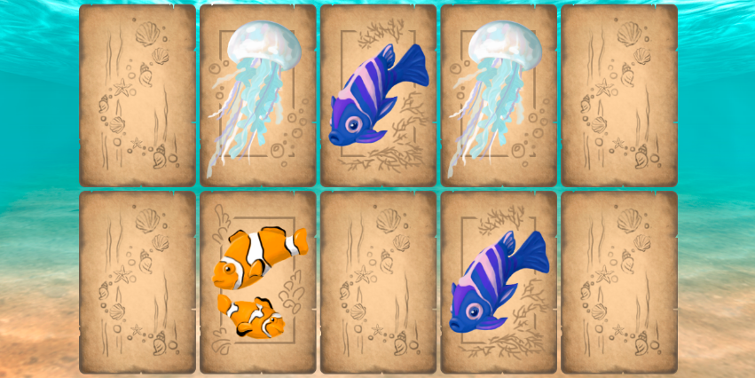

# <a name='nav'>Memory game</a>

Игра Memory, написанная с использованием фреймворка Phaser 3. Вы можете посмотреть демо-версию сайта на [GitHub Pages по этой ссылке](https://voverg.github.io/games/memory 'Посмотреть демо-версию')

- [Описание](#description)
- [Description(eng)](#description_eng)

---

## <a name='description'>Описание</a>
Приложение "Memory":
-
-
-

[Назад к заглавию](#nav)
