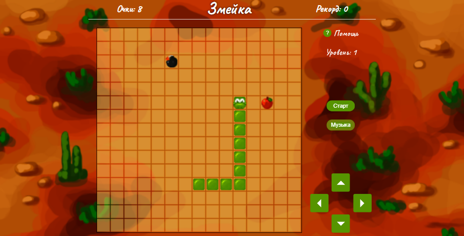

# <a name='nav'>snake</a>

Это браузерная игра Змейка. Вы можете посмотреть демо-версию сайта на [GitHub Pages по этой ссылке](https://voverg.github.io/games/snake 'Посмотреть демо-версию')

- [Описание](#description)
- Кнопка [Старт] или клавиша Пробел - начать/приостановить игру
- Кнопка [Музыка] или клавиша S - включить/выключить музыку
- Стрелки [вверх/вниз/влево/вправо] - управление движением змейки
- Игра состоит из разных уровней. Чтобы пройти уровень, нужно набрать 20 очков и не столкнуться с препятствиями
- В первых 3-х уровнях змейка может проходить сковзь стены, начиная с 4-го уровня границы игрового поля становятся препятствием
- Начиная со 2-го уровня появляются бомбочки, и с каждым новым уровнем их становится всё больше. И они ещё перемещаются по полю :)
- В каждой игре посчитывается кол-во набранных очков и рекорд, который был достигнут в текущем уровне
- Уровень и рекорд записываются в Local Storage, так что при перезагрузке страницы ваш игровой прогресс сохранится

---

