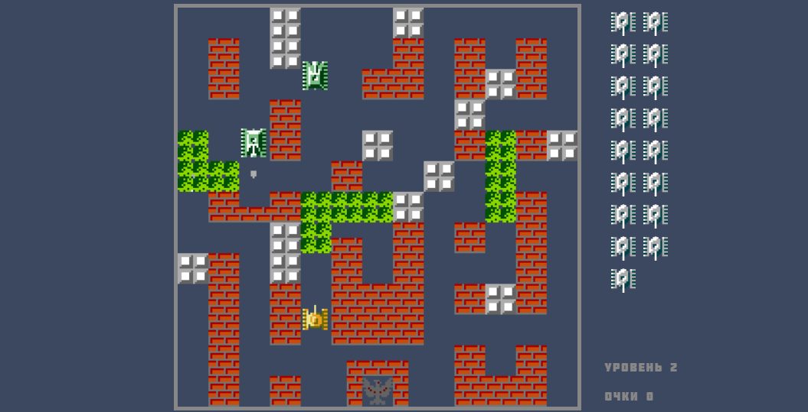

# <a name='nav'>Танчики</a>

Игра Танчики, написанная на HTML, CSS и чистом JavaScript. Посмотреть демо-версию игры можно на [GitHub Pages по этой ссылке](https://voverg.github.io/games/tanks 'Посмотреть демо-версию')

- [Описание](#description)

---

## <a name='description'>Описание</a>
Приложение "Танчики" (описание игры есть в самой игре, тут я лучше расскажу про архитектуру приложения):
- В этой игре используется подобие паттерна Entity Component System (но изначально это был просто MVC :)
- Суть заключается в том, что все игровые объекты - это сущьности, которые имеют свои свойства (размеры, координаты, спрайт и прочее). То есть построение архитектуры начинается с описания игровых сущьностей.
- Далее для работы с игровыми сущьностями описываются модели, которые представляют собой классы, содержащие основной массив, в который добавляются сущьности и методы для работы с этим массивом.
- Вся игровая логика содержится в контроллерах (если по ECS архитектуре, то это System), которые внутри себя перебирают массивы моделей и с помощью методов моделей вносят измениения в сущьности
- Визуальная отрисовка в браузере происходит с помощью компонентво, которые перебирают массивы моделей, берут из них данные и отображают.

[Назад к заглавию](#nav)
